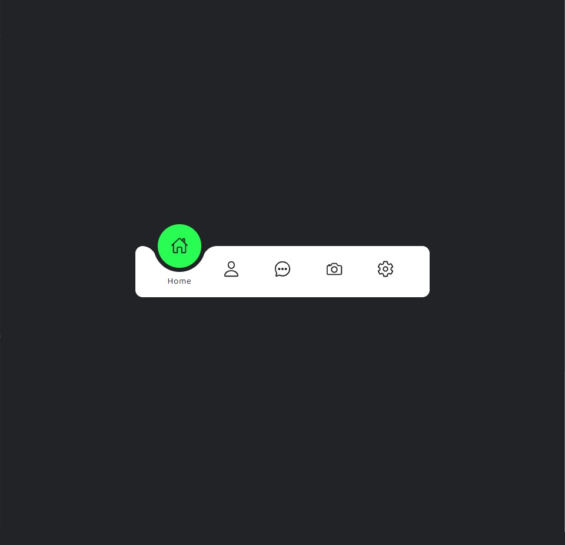

<h1 align="center">Animated Navigation Menu</h1>

<h2 align="center">Sobre o projeto: </h2>

  Projeto desenvolvido de um tutorial do canal: <a href="https://www.youtube.com/c/OnlineTutorials4Designers">Online Tutorials</a> focado em tutoriais de técnicas avançadas em CSS3.

  Nesse projeto simples foi desenvolvido um menu animado utilizando os seguintes princípios:
  <ul>
   <li>animação do CSS3, como o <code>transform</code> e <code>transition</code></li>
   <li>uma lógica de como o botão se comportaria ao ser clicado usando JavaScript</li>
   <li>escolha dos ícones da biblioteca IonIcons que se baseia em UX/UI</li>
  </ul>

<h2 align="center">Tecnologias & Utilitários</h2>

  
   
  

  
  

  <iframe 
    src="https://www.loom.com/embed/f0dfdf84aaba481db28fec076b663a35" 
    frameborder="0" 
    webkitallowfullscreen mozallowfullscreen allowfullscreen 
    style="position: absolute; top: 0; left: 0; width: 100%; height: 100%;">
  </iframe>

  

